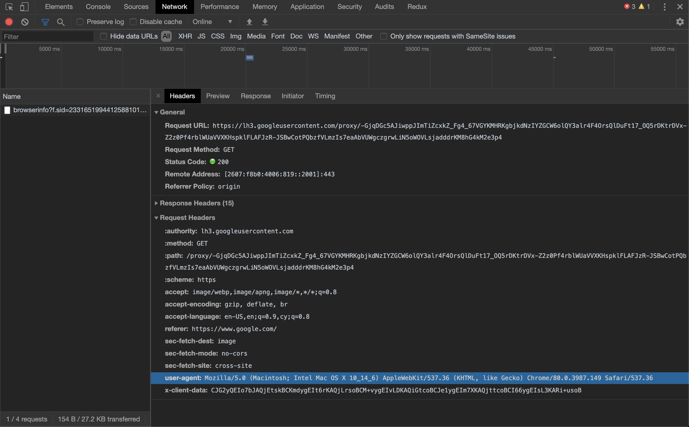

# Part 1: Online-Calendar

## Goal
In the previous challenge, you built a calendar web application with JavaScript, HTML, and CSS. The content of the schedule was found in the global variable "schedule". In production, data is frequently stored in a remote database.
In this challenge you have 3 main tasks:

- [ ] You will need to make an ajax request to a database on a remote URL.
- [ ] You will need to extract your current week's schedule from there.
- [ ] You will need to display this data in your calendar application.

## How do I get started
As usual, there will be some setup involved before you can get started.

- [ ] You should already have this repo forked and cloned from the previous unit, so use `cd` to navigate to this project's directory on your machine
- [ ] ***important:*** Make sure all your previous work is committed before moving on with the steps: use `git status` and then `add` and `commit` any uncommitted work until `git status` returns "nothing to commit, working directory clean"
- [ ] To update your cloned repo with files from the Codesmith GitHub Organization, we first need to link our local repository to the Codesmith GitHub Organization. To add a remote - which we will name `upstream` - to our local repository, run the following command in your terminal.<br>
```
git remote add upstream https://github.com/CodesmithLLC/unit-project-slack.git
```
- [ ] Once your project directory is clean (i.e. everything is committed), use Git's [fetch](https://git-scm.com/docs/git-fetch) command to copy down the `unit-5` branch to your machine: `git fetch <remote-name> <remote-branch-name>:<local-branch-name>`
```
git fetch upstream unit-5:unit-5
```

- [ ] You now have a branch called `unit-5`. Switch to it with `git checkout unit-5`. Work from here. If you ever lose track of which branch you are on, check using `git branch`.

- [ ] Next, use the following command to install any new npm dependencies:
```
npm install
```

- If you'd like to continue working from where you left off on the last unit:
	- [ ] switch back to your previous branch (you remember the `git checkout` command, right?) and copy your code from the index.html and the main.js
		- hint: to see a list of all branches (including your current branch), type `git branch`
	- [ ] Switch back to the `unit-5` branch
	- [ ] Paste your previous code back into index.html and main.js
- [ ] Start your server by running:
```
npm start
```

- [ ] Visit http://localhost:3000 to view your index.html page
	- *Note: for this unit and all further units you should be using your Web server to view your site rather than loading index.html in your browser directly.*

## Challenges

You may use vanilla JavaScript or jQuery to complete these challenges. Try to implement each step both ways and see which one you like better. [Here](http://youmightnotneedjquery.com) for some tips on how to perform common tasks each way.

- [ ] Modify your main.js code to perform an asynchronous HTTP GET request to the following URL: <br> ```http://slack-server-production.us-west-2.elasticbeanstalk.com/calendar/{LA or NY}/{COHORT_NUMBER}```
	- ***The format of the data received from the URL will be different from the schedule object given in the previous challenge, so don't expect your old code to work without modification***
- [ ] Once you've retrieved the calendar data, populate the DOM with the data so that the user can see their calendar entries
- [ ] **BONUS (Only attempt if you have extra time)**: Use jQuery's promise feature to control your asynchronous GET request

## How do I test if my answer is correct?
Run the following code in your terminal to test your code:
```
npm test
```

Treat the tests for this unit as a guideline and not as an absolute. You may choose to implement your calendar in a slightly different way than the tests are expecting which could cause the tests to fail, and that's fine - as long as you can get your calendar data into the DOM you're on the right track.

---

# Part 2: Online-Chatroom

## Summary
In part 1, we used an asynchronous request to retrieve calendar data and then used that data to populate the DOM so that the user could view their calendar entries. In part 2 we're going to use even more asynchronous requests so that you can develop a deeper understanding and familiarity with asynchronous code. If you remember one thing from this unit, remember that [AJAX](https://en.wikipedia.org/wiki/Ajax_(programming)) (asynchronous JavaScript and XML) allows the browser to communicate with a foreign server without reloading the page.


Imagine if on Slack the entire page had to refresh every time a new message was posted - that's crazy. Prior to AJAX the browser would need to refresh the page in order to change. With AJAX, we can send a request to the server and - when the server responds - we can modify the page dynamically with JavaScript.

### Request
Every asynchronous request is at its core an HTTP request. The browser sends a `request` object to the server with information regarding the broswer's intention with the server. There are major request types (or methods) that provide valuable information about the browsers intention:

- GET
- POST
- PUT
- DELETE

**GET** requests are primarily used for fetching data from a the server. For example, when you load Faceboook, your browser is making a GET request for all of your friends' latest post to populate the news feed. **POST** requests are used to provide data to the server. Whenever you are using Facebook messengers, and you send a message - a POST request is being made by your browser to add your message the server. **PUT** requests are used to update data on the server. **DELETE** requests inform the server that some data needs to be deleted.

### HTTP Headers


In addition to the request **method**, the browser may provide additional information and instructions about its request in the form of **[request headers](https://en.wikipedia.org/wiki/List_of_HTTP_header_fields)**.

A few examples of what is provided in the HTTP headers:

- **Accept:** Informs the server what file type the browser expects to receive back from the server
- **User-Agent:** Information about the method at which the browser is communicating with the server


## Challenges
- [ ] Create an area in your HTML where chat messages can be displayed. You may create this area either statically (editing your index.html file directly), dynamically (by interacting with the DOM using JavaScript in main.js), or with a combination of the two.

- [ ] Retrieve the list of messages from our messaging server by making a **GET** request to the following URI: <br>```https://curriculum-api.codesmith.io/messages```

- [ ] Using JavaScript, populate your messages area with the list of messages retrieved via the AJAX request.


- [ ] Create a text input and submit button where users of your chatroom can enter and submit their messages.


- [ ] Post messages to the server by making a **POST** request to the same URI as above. Include a **body** with your AJAX request that includes information about your message. The body should contain the properties `created_by` and `message`. The server is expecting the body of the POST request to be encoded as **JSON**.  
	- *Hint: you may need to tell the server what type of data you're sending over*

Below is a sample message:

```javascript
{
  created_by: "Alex Zai",
  message: "Sample message"
}
```

### How do I test if my answer is correct?

Run the following command in the terminal:
```
npm test
```

Again: Treat the tests for this unit as a guideline and not as an absolute. You may choose to implement your chatroom in a slightly different way than the tests are expecting which could cause the tests to fail, and that's fine - as long as you can get your messages data into the DOM and POST messages to the server then you're on the right track.
